# LEGO_projects

Some LEGO® Technic projects made with [LeoCAD](https://www.leocad.org/).

## Legopard

## Industrial robot model (inspired by the **KUKA Quantec** series)

- [Building instructions](/Robot/robot_instr/robot_instr.md) (made with [LPub3D](https://trevorsandy.github.io/lpub3d/))
- [Public wishlist on BrickOwl](https://www.brickowl.com/wishlist/view/goeroeg/robot)

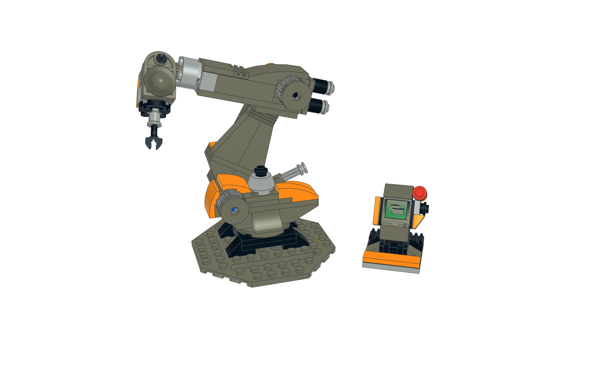

## Small Industrial robot model (inspired by the **KUKA Agilus** series)

- [Building instructions](/Robot/robot_instr/agilus_instr.md) (made with [LPub3D](https://trevorsandy.github.io/lpub3d/))
- [Public wishlist on BrickOwl](https://www.brickowl.com/wishlist/view/goeroeg/robot-small)

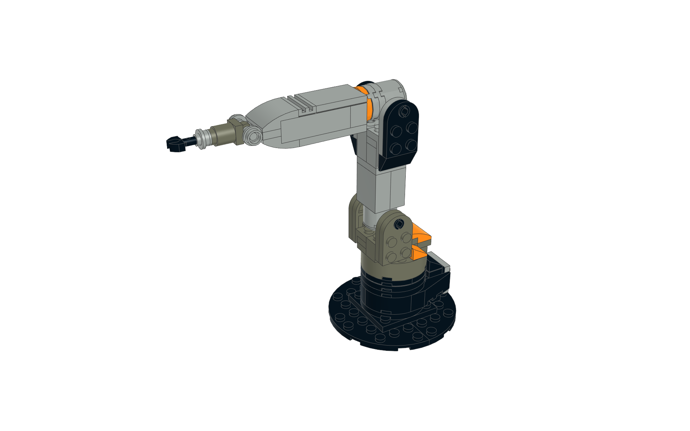

## Collaborative 7 axis robot model (inspired by the **KUKA iiwa**)

- [Building instructions](/Robot/iiwa_instr/iiwa_instr.md)
- [Public wishlist on BrickOwl](https://www.brickowl.com/wishlist/view/goeroeg/iiwa)

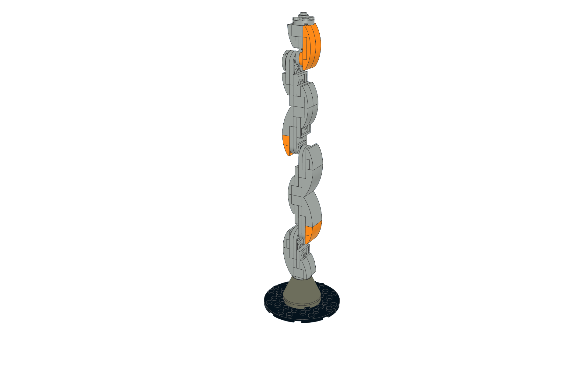

## Blitz 5

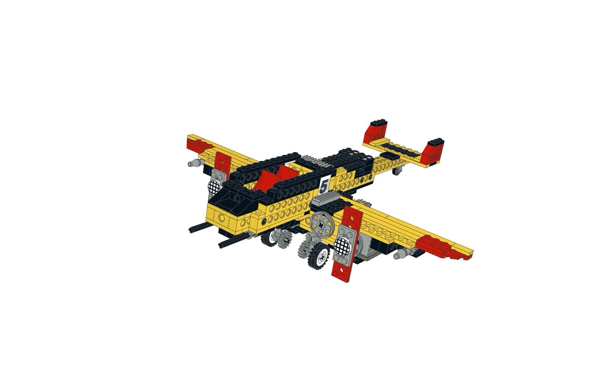

## Crane

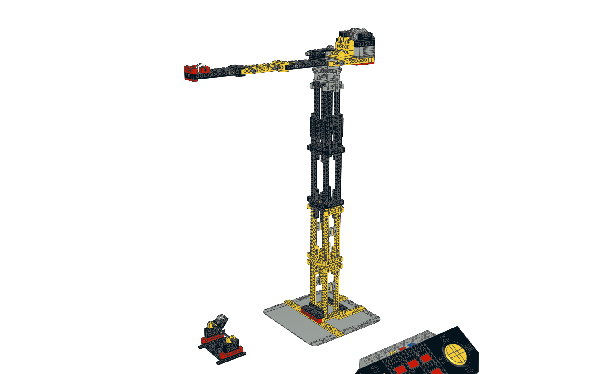

## Whirlwind

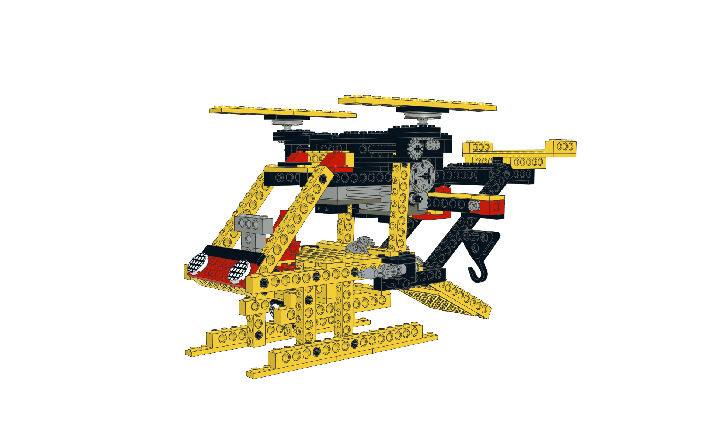

## Tractor with a trailer

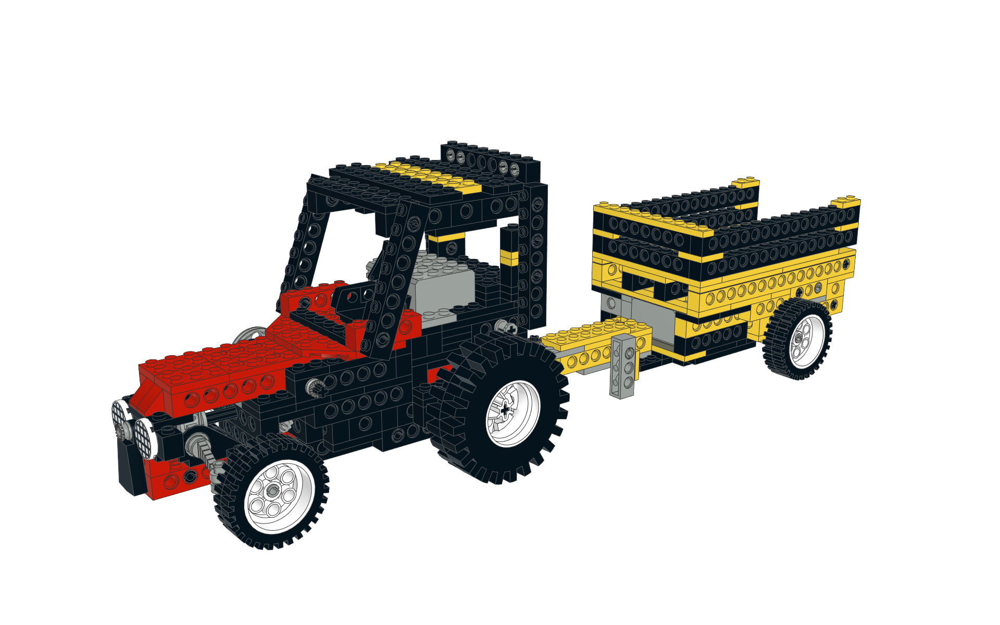
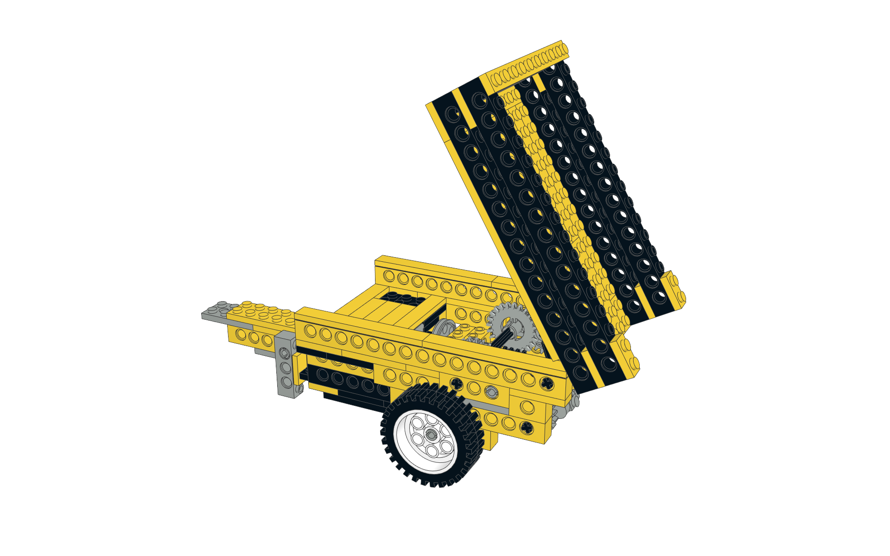

## Truck with trailer

## Misc

Some other smaller projects...

### Drone

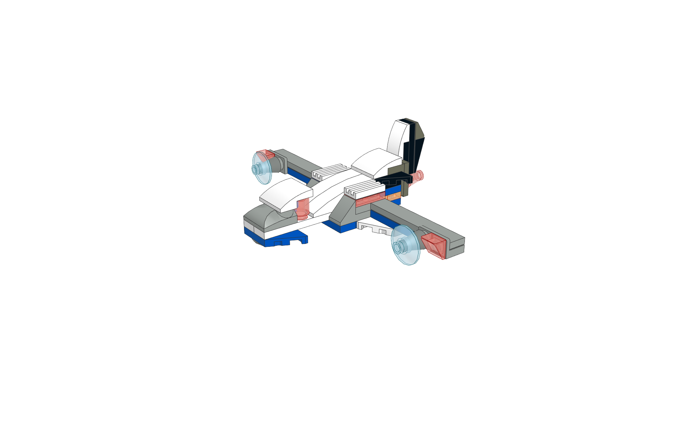

### Simple chess

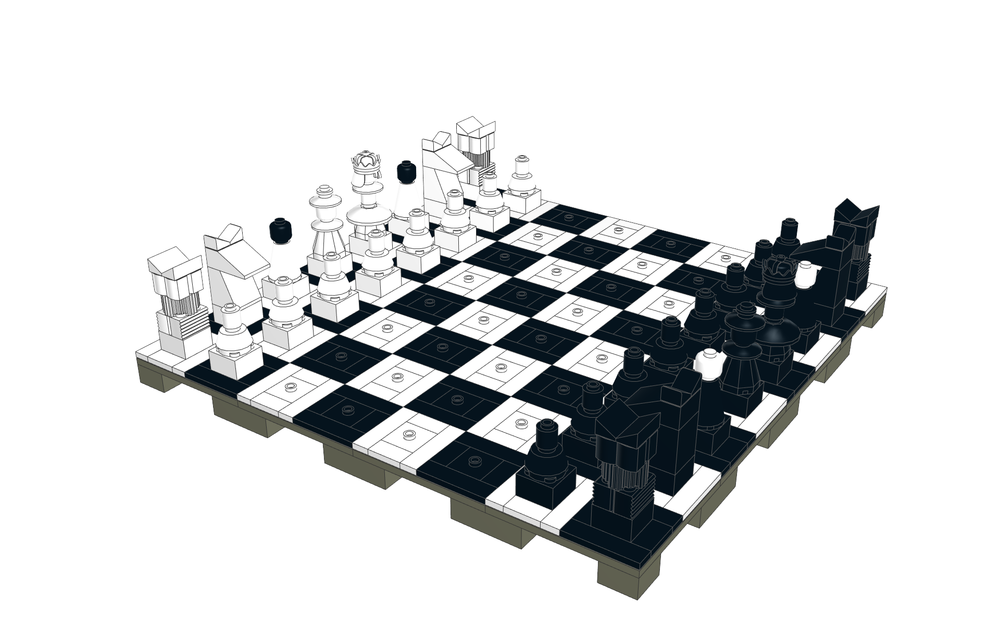

### Scale

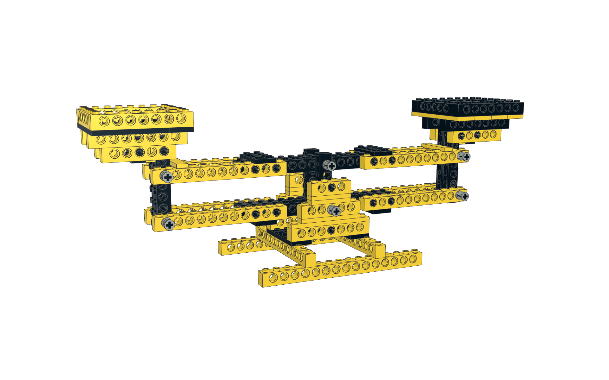

---

## License

All content in this repository is licensed under the terms of [Creative Commons BY-SA 4.0](https://creativecommons.org/licenses/by-sa/4.0/)

## How to contribute

If you have any ideas just create an issue or even a pull request...

---

LEGO® is a trademark of the LEGO Group of companies which does not sponsor, authorize or endorse these models
