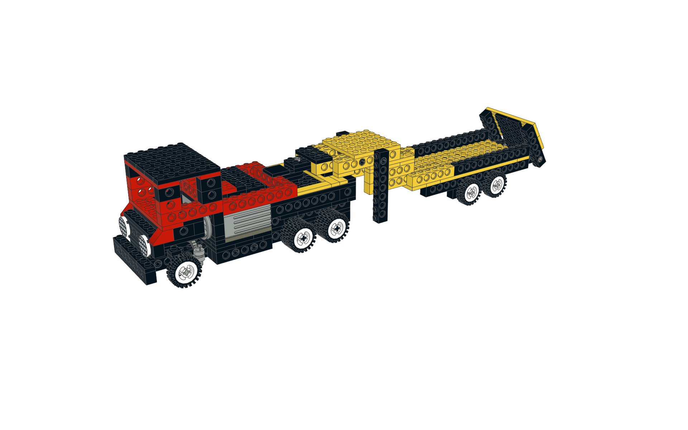

# LEGO_projects
Some LEGO® Technic projects made with [LeoCAD](https://www.leocad.org/).

## Legopard

## Crane

## Whirlwind

## Truck with trailer

---

# License

All content in this repository is licensed under the terms of [Creative Commons BY-SA 4.0](https://creativecommons.org/licenses/by-sa/4.0/)

# How to contribute

If you have any ideas just create an issue or even a pull request...

---

LEGO® is a trademark of the LEGO Group of companies which does not sponsor, authorize or endorse these models
